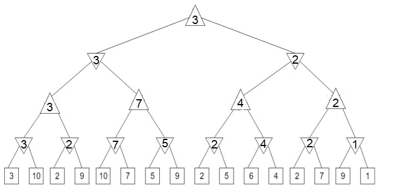
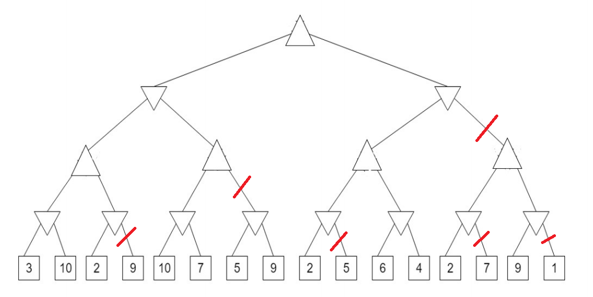

James Oswald
Homework #2

# Dependencies
The programs were written and tested on Python 2.8.5, and only make use for the built-in queue library. 

# Problem 1: Informed Search
 
## Part (1): Greedy Search
 
### Thought Process
For my greedy search algorithm, I worked off of the idea of it being a depth first search that rather than using a stack, pops off the node with the most promising heuristic value. Doing the calculations by hand yielded the same results as my algorithm. 
 
### Code and Results 
The code can be found in `/src/InformedSearch.py` as the function named `greedySearch`. The program results can be found in `/output/InformedSearch.txt` under the `Greedy Search:` section. The results read:
```
Greedy Search:
Expanded to: ['S', 'e', 'r', 'f', 'G']
Path returned: ['S', 'e', 'r', 'f', 'G']
```
 
## Part (2): A* Search 
### Thought Process
For my A* search algorithm, I used the idea of a queue from Uniform Cost Search and the heuristics from greedy search together along with the appropriate math to calculate which node to expand to next.
 
### Code and Results 
The code can be found in `/src/InformedSearch.py` as the function named `AStarSearch`. The function utilizes the built-in queue library for its `PriorityQueue` class. The program results can be found in `/output/InformedSearch.txt` under the `A* Search:` section. The results read:
```
A* Search:
Expanded to: ['S', 'd', 'e', 'r', 'b', 'a', 'f', 'G']
Path returned: ['S', 'd', 'e', 'r', 'f', 'G']
```
 
## Part (3): Admissibility
Yes this graph with heuristic h is admissible. This is because for each node, its heuristic is optimistic, satisfying the inequality `0 <= h(n) <= h*(n)`. In other words, for every single node, the true shortest distance to the goal counted along the edges of the graph, is greater than the heuristic’s value for that node. To compute this, I went node by node with a sheet of paper to verify that this held for all nodes and their heuristics. 
 
## Part (4): Consistency
Yes this graph with heuristic h is consistent. This is because we can show there does not exist an "arc" from a node `A` to a node `C` for which the inequality `h(A) - h(C) <= cost(A to C)` is violated. In the case for our graph, I have again gone through and verified that every single arc fails to violate this inequality, the difference of the heuristic between the nodes is always smaller or equal to the true cost between nodes.
 
# Problem 2: Constraint satisfaction problems
 
## Part (1):
### Question
After a value is assigned to A, which domains might be changed after forward checking for A?
 
### Answer 
After assigning a value to A, the domains of the connected nodes: D, E, B will be modified to only allow themselves to be the opposite color of A. Despite seeing in the domains that we are now forced to place two nodes of the same color next to each other on the next step, forward checking does not deal with 2 variables at one step so we ignore this observation and proceed as if everything is normal.  
  
Note:  
Table implied to be done without loss of generality, Black(B) and White(W) could easily be switched, but we demonstrate as if we're assigning Black(B) to A.  
```
            A   |B   |C   |D   |E   |F   |G   |H   |I   |J
FwCheckA    B   |W   |B,W |W   |W   |B,W |B,W |B,W |B,W |B,W
```
 
## Part (2):
### Question
After a value is assigned to A, then forward checking is run for A. Then a value is assigned to D. Which domains might be changed as a result of running forward checking for D?
 
### Answer 
Once forward checking is run for D after being run for A, the domain of F will be reduced to only be the opposite color of D, the domain of E will become empty because forward checking for A already removed its ability to be the color of A, and now we are removing its ability to be the color of D, which is not the color of A. 
Note:  
Table implied to be done without loss of generality, Black(B) and White(W) could easily be switched, but we demonstrate as if we're assigning Black(B) to A.  
```
            A   |B   |C   |D   |E   |F   |G   |H   |I   |J
FwCheckA    B   |W   |B,W |W   |W   |B,W |B,W |B,W |B,W |B,W
FwCheckD    B   |W   |B,W |W   |    |B   |B,W |B,W |B,W |B,W
```
 
## Part (3):
### Question
After a value is assigned to A, which domains might be changed as a result of enforcing arc consistency after this assignment?
 
### Answer
After assigning to A and enforcing Arc Consistency, we see it change the domains of everything adjacent to A: D, E, B. Once these are modified, we propagate out since we removed something from their domains. C's domain is constrained so that it's guaranteed to be the same as A, due to B. Starting then moving to D, I see E is immediately empty and we see the problem can’t be solved, but still propagate to the domains of F and H limiting them to one color. 
```
                A   |B   |C   |D   |E   |F   |G   |H   |I   |J
ArcConsistA     B   |W   |B   |W   |    |B   |B,W |W   |B,W |B,W
```
 
## Part (4):
### Question
After a value is assigned to A, and then arc consistency is enforced. Then a value is assigned to D. Which domains might be changed after enforcing arc consistency after the assignment to D?
 
### Answer
After assigning to A and enforcing Arc Consistency, Then assigning to D, we see that nothing changes because there was already only one thing to pick from in the domain of D. Thus nothing changes because we already propagated based on this constraint when enforcing arc consistency after assigning to A. 
```
                A   |B   |C   |D   |E   |F   |G   |H   |I   |J
ArcConsistA     B   |W   |B   |W   |    |B   |B,W |W   |B,W |B,W
ArcConsistD     B   |W   |B   |W   |    |B   |B,W |W   |B,W |B,W
```
 
## Part (5):
### Question
Is there a valid solution for assigning colors to all graph nodes? Why?
 
### Answer
No there isn't. This is made clear in both the forward checking and arc consistency case. The A, D, E triangle connection between these nodes with these constraints is impossible to color using only two colors. This is made even more apparent when looking at the empty domain of E generated by forward checking after assigning to A and D, which is also clearly observable in both arc consistency cases. 
 
# Problem 3: Adversarial search
 
## Part (1): Minimax Search
### Thought Process
The minimax search is a straightforward process to implement recursively based on the node type.
 
## Code and Results
The code can be found in `/src/AdversarialSearch.py` as the function named `minimaxSearch`. The program results can be found in `/output/AdversarialSearch.txt` under the `Minimax Search:` section. The results read:
```
Performing Minimax Search:
The chosen terminal state: 3
```
 
## Part (2): Manual Minimax Computation

 
## Part (3): alpha-beta pruning
### Thought Process
The minimax search with alpha beta pruning utilizes an alpha and beta passed along the recursive minimax search to help discover if subtrees can be pruned.
 
## Code and Results
The code can be found in `/src/AdversarialSearch.py` as the function named `alphaBetaPrune`. The program results can be found in `/output/AdversarialSearch.txt` under the `Minimax Search with alpha-beta pruning:` section. The results read:
```
Performing Minimax Search with alpha-beta pruning:
Pruned llrl alpha: 3 beta: inf
Pruned lrl alpha: -inf beta: 3
Pruned rlll alpha: 3 beta: inf
Pruned rrll alpha: 3 beta: 4
Pruned rrrr alpha: 3 beta: 4
Pruned rr alpha: 3 beta: 4
The chosen terminal state: 3
```
 
## Part (4): alpha-beta pruning results
### Results
The following branches are cut off at some point while searching, almost all of them are cut off due to the alpha of 3 being the best available option to the maximizer and the beta of 4 being the best option for the minimizer. 
```
Branch llrl     alpha: 3       beta: +inf
Branch lrl      alpha: -inf    beta: 3
Branch rlll     alpha: 3       beta: +inf
Branch rrll     alpha: 3       beta: 4
Branch rrrr     alpha: 3       beta: 4
Branch rr       alpha: 3       beta: 4
```

Since this is just a more efficient Minimax search, we do not obtain the output path, but rather just obtain the chosen terminal state.